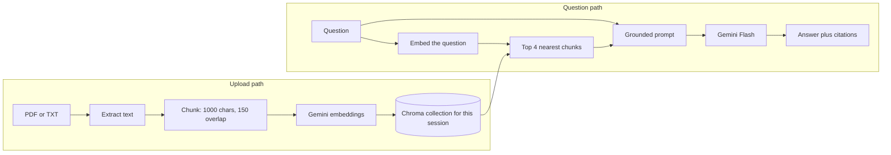

# DocuRAG

DocuRAG is a small document Q&A app. You upload PDFs or text files, then ask questions in plain language. Answers are written from those files, and each answer shows the filename, page (for PDFs), chunk index, and a short snippet of the text that was retrieved.

## What this is, and why

A large language model will happily answer from memory. That is useful, and it is also how the model invents policies, numbers, and citations that were never in your file. Retrieval-Augmented Generation (RAG) avoids that by doing the job in two steps:

1. **Retrieve.** Search the uploaded documents for the few passages that are actually about the question.
2. **Generate.** Give the model only those passages, and tell it to answer from them or to say it does not know.

The model is still the writer. Your documents are the evidence. A fact that is written down is stated directly. A question that needs a judgment, such as a likely salary, gets a short inference labeled "This is not stated in the document," built only from roles, skills, and dates that are in the file. If the file is not about the question at all, DocuRAG replies exactly: `I don't have enough information`.

## Architecture



In words:

- **Upload.** The API extracts text (pypdf for PDFs, plain decode for TXT). A PDF with almost no text layer is treated as a scan: PyMuPDF renders the pages and Gemini transcribes them. Text is split with LangChain's `RecursiveCharacterTextSplitter`. Gemini's embedding model returns a vector per chunk. ChromaDB stores the vector, the chunk text, and metadata (filename, chunk index, page, content hash) in a collection that belongs to one `session_id`. Uploading the same bytes again is skipped. Uploading the same filename with different bytes replaces that file.
- **Question.** A follow-up is rewritten into a standalone search query. The same embedding model turns that query into a vector. Chroma returns the nearest chunks from that session only, up to 8, so a short document is included whole. Those chunks, plus the recent conversation, are pasted into a prompt. Gemini Flash answers facts from them and, when the question needs it, reasons from them without pretending an inference was written in the file. Estimates such as pay are a range tied to the role and seniority in the excerpts. The UI streams the answer and shows the chunks that were retrieved.

The browser remembers the session id (and the chat transcript) in `localStorage`. The vectors stay on disk in Chroma. The Gemini API key stays on the backend.

```
docurag/
  backend/
    main.py                 # FastAPI routes
    rag/ingest.py           # extract, chunk, embed, store, skip duplicates
    rag/retrieve.py         # top-k search, grounded prompt, Gemini answer
    rag/ocr.py              # scanned PDF pages, transcribed by Gemini
    rag/vectorstore.py      # persistent Chroma, one collection per session
    rag/llm.py              # Gemini chat + embedding clients
    rag/ratelimit.py        # per-address request limits
    rag/errors.py
    eval/run_eval.py        # overlap, dedup, and handbook retrieval checks
  frontend/                 # React + Vite + Tailwind
  samples/employee-handbook.txt
  docker-compose.yml
```

## Setup

You need a Gemini API key from [Google AI Studio](https://aistudio.google.com/apikey).

```text
GEMINI_API_KEY          required on the backend only
GEMINI_CHAT_MODEL       optional, default gemini-3.8-flash
GEMINI_EMBED_MODEL      optional, default gemini-embedding-001
CHROMA_PERSIST_DIR      optional, default backend/chroma_data
CORS_ORIGINS            optional, defaults include localhost:5173 and :8080
VITE_API_URL            frontend only, default http://localhost:8000
```

Copy the example env file from the `docurag` directory:

```powershell
copy .env.example .env
# then edit .env and set GEMINI_API_KEY
```

`gemini-1.5-flash` is retired, and new API keys cannot call `gemini-2.5-flash`. The default chat model is `gemini-3.8-flash`. If your key is rejected for that id, set `GEMINI_CHAT_MODEL` to a flash model listed in the current [Gemini model docs](https://ai.google.dev/gemini-api/docs/models). Keep the embedding model stable for the life of a Chroma directory: vectors from two different embedding models are not comparable. If you change `GEMINI_EMBED_MODEL`, delete `chroma_data` (or run `docker compose down -v`) and upload again.

### Run with Docker Compose

From the `docurag` directory, with Docker Desktop running:

```powershell
docker compose up --build
```

- App: http://localhost:8080
- API docs: http://localhost:8000/docs

The Chroma index is stored in the `chroma_data` volume. `docker compose down` keeps it. `docker compose down -v` deletes it.

The image runs uvicorn with one worker on purpose. Chroma's local store is a single SQLite database; a second process on the same path will lock or corrupt it.

### Run locally without Docker

Use Python 3.11+ and Node 20+. Two terminals, both starting in `docurag`.

Backend:

```powershell
cd backend
python -m venv .venv
.\.venv\Scripts\Activate.ps1
pip install -r requirements.txt
$env:GEMINI_API_KEY = "your_key_here"
uvicorn main:app --reload --port 8000
```

```bash
cd backend
python -m venv .venv
source .venv/bin/activate
pip install -r requirements.txt
export GEMINI_API_KEY=your_key_here
uvicorn main:app --reload --port 8000
```

Frontend:

```powershell
cd frontend
npm install
npm run dev
```

Open http://localhost:5173. Vite reads `VITE_API_URL` from `frontend/.env` if you create one; otherwise it calls `http://localhost:8000`.

There is no login. Do not expose this API to the public internet. Anyone who can reach it can upload files and spend your Gemini quota.

### Try it

Upload `samples/employee-handbook.txt`, then ask:

- How many vacation days do employees get?
- What is the laptop stipend?
- Where is headquarters?
- Who is the CEO of Google?

The last question is not in the handbook. The answer should be `I don't have enough information`, with the retrieved excerpts still listed underneath so you can see what the model was shown.

From the shell, the same flow is:

```powershell
curl.exe -F "files=@samples/employee-handbook.txt" http://localhost:8000/documents/upload
curl.exe -X POST http://localhost:8000/chat/SESSION_ID_FROM_THE_UPLOAD -H "Content-Type: application/json" -d "{\"question\":\"How many vacation days do employees get?\"}"
```

### API

| Method | Path | Purpose |
| --- | --- | --- |
| `POST` | `/documents/upload` | Multipart field `files` (repeatable) and optional form field `session_id`. Returns `session_id`, `chunks_indexed`, `skipped`, and the document list. |
| `POST` | `/documents/upload/stream` | Same upload as server-sent events: `status` messages, then `result`. |
| `GET` | `/documents/{session_id}` | Filenames and chunk counts. |
| `DELETE` | `/documents/{session_id}` | Deletes that session's Chroma collection. |
| `DELETE` | `/documents/{session_id}/file?filename=` | Removes one file's chunks. |
| `POST` | `/chat/{session_id}` | JSON body `{ "question": "...", "history": [] }`. Returns `answer` and `sources` (filename, chunk index, page, snippet). |
| `POST` | `/chat/{session_id}/stream` | Same answer as server-sent events: `sources`, then `token` pieces, then `done`. |

Expected failures: empty file, unsupported type, a scan that still has no readable text, chatting before any chunks exist, missing `GEMINI_API_KEY`, more than 10 uploads or 30 questions per minute from one address (HTTP 429), and Gemini API errors (quota, model name, network). Those return a JSON `detail` string, or an `error` event on the stream endpoints.

Uploading the same file bytes again does not add a second copy. Uploading the same filename with different contents replaces that file. Remove one file from the sidebar, or clear the session to drop everything.

## How retrieval works

**Chunk size is 1000 characters, overlap is 150.** LangChain's splitter measures that with `len()`, not tokens. 1000 characters is roughly 200–250 tokens of English: long enough to hold a paragraph, short enough that a match points at a specific policy instead of a whole chapter.

**Overlap** repeats the end of one chunk at the start of the next, so a fact sitting on the cut still appears whole in one of them. The detail that surprises people: LangChain does not copy 150 raw characters. It keeps previous *pieces* while they fit in the overlap budget. A paragraph is longer than 150 characters, so splitting on blank lines leaves the next chunk with no shared text. DocuRAG splits on spaces instead. Each piece is a word, about 150 characters of words are repeated, and a word is never cut in half. Newlines stay in the text, so the model still sees paragraph breaks.

**Top-k is up to 8.** The question is embedded with the same model that embedded the chunks, and Chroma returns the nearest neighbors under cosine distance. Cosine compares the direction of two vectors, which is what retrieval embeddings are trained for. A resume or handbook is only a handful of chunks, so retrieving all of them lets the model connect a skill on page 1 with a project on page 2. Past 8 chunks the search stays capped: more context costs tokens and can distract the model. If the session has fewer chunks than the cap, you simply get all of them.

**Why the prompt is grounded.** The chat model never receives the raw file. It receives the question, the recent conversation, and the retrieved excerpts. Facts have to come from that text. When you ask for something the file does not state, such as a salary, the model may infer from the evidence it was given, and it has to say the number is not in the document. A pay estimate has to be a range, and it has to name the role, skills, or seniority it used. If those anchors are missing, it does not invent a figure. It still must not invent an employer, a date, or a metric. Unrelated questions get `I don't have enough information`. The UI shows the snippets because the model can still misread a passage that is in the context. Those sources are the retrieved chunks in rank order (best match first), not a citation string the model made up.

A follow-up such as "how often is that paid?" is a weak search string on its own. When the request includes earlier turns, a short rewrite turns it into a standalone query before the embedding step. The answer prompt still sees the conversation, so "the second internship" can be resolved, but the excerpts remain the evidence.

Two details that matter when you explain this:

- Document chunks and the question are embedded with retrieval task types (`RETRIEVAL_DOCUMENT` and `RETRIEVAL_QUERY`) on `gemini-embedding-001`. Same model, slightly different instructions, so "how many vacation days?" can land next to a paragraph that says "18 vacation days" even when the wording does not match.
- Each session is its own Chroma collection. Search cannot see another session's files, and clearing a session is one collection delete. A shared collection plus a metadata filter would also work, but forgetting the filter once would leak another upload into the prompt.

PDFs are split per page before chunking, so a chunk cut from page 4 keeps `page: 4`. If pypdf finds almost no text, the page is a scan. PyMuPDF renders up to 15 pages and Gemini transcribes the images. A page that is still empty after that is rejected.

From the `backend` directory, `python -m eval.run_eval` checks chunk overlap, duplicate skipping, the rate limit, and PDF rendering without calling Gemini. When `GEMINI_API_KEY` is set it also indexes the sample handbook in a temporary Chroma directory and checks that vacation days, the stipend, the address, and parental leave come back.
